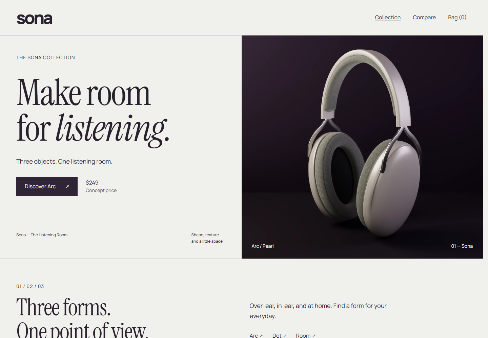
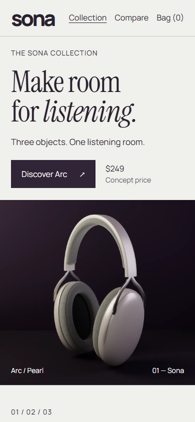
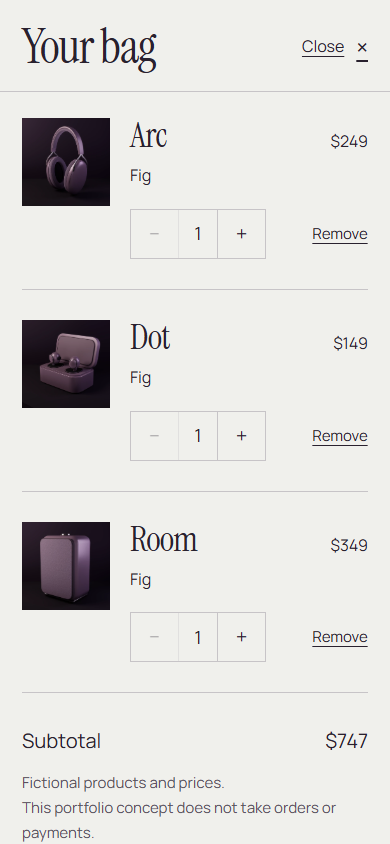

# Sona — The Listening Room

A personal frontend portfolio project: an original audio storefront built with React and TypeScript. Explore Arc headphones, Dot earbuds and the Room speaker, compare the collection, and build a bag across products and finishes. All products and prices are fictional; there are no payments, orders, accounts or backend services.



<p>
  
  
</p>

These are actual local browser captures from the September 29 collection review. [Full collection](docs/publication/screenshots/after-desktop-home-full.png) · [Comparison](docs/publication/screenshots/after-desktop-comparison.png) · [Phone product page](docs/publication/screenshots/after-phone-dot.png)

## Working experience

- **Three products, three finishes:** shared product pages, Pearl/Graphite/Fig selection, aligned imagery and dedicated material close-ups.
- **Comparison:** native checkboxes select zero to three products; a semantic comparison table remains keyboard-scrollable on narrow screens.
- **Persistent bag:** variants merge by product and finish, with quantities from 1–99, removal, subtotal and empty states. Validated local storage restores the bag; blocked storage leaves a usable in-memory bag with an explanation.
- **Navigation:** product finishes, comparison selection and bag visibility live in the URL. Back/Forward and reload preserve the relevant state; route changes manage focus and scroll.
- **Responsive interactions:** keyboard-accessible controls, a native modal dialog, live cart feedback, reduced motion and image-failure handling. Shopping stays available while images decode or transitions run.

## Stack and decisions

React 19, TypeScript, React Router 7 and Vite. CSS and the Web Animations API handle motion; there is no storefront animation or state-management dependency. Vitest covers cart rules, with Playwright and axe supporting browser verification.

The typed catalog owns product definitions and integer-cent prices. A cart reducer/provider owns validated line items; transient image and animation state stays in the gallery. Original Three.js geometry is rendered offline into responsive WebPs, preserving finish alignment without shipping the 3D engine to shoppers. Instrument Serif and Manrope are self-hosted with their OFL notices.

[Engineering and interview notes](docs/engineering.md) · [Arc asset sources](assets/arc/README.md) · [Dot and Room asset sources](assets/collection/README.md)

## Run locally

Requires Node.js 22.12+ and npm. From this folder:

```sh
npm ci
npm run preview:start
npm run preview:status
```

Open **http://127.0.0.1:4173/**. The launcher starts a detached, loopback-only Vite development preview, verifies the page and all three product assets, and records its process identity/log in ignored `.cache/`. `npm run preview:stop` stops only its verified process; another port owner is left alone. Keeping the origin fixed preserves the bag's browser storage. `npm run dev` is the foreground alternative.

```sh
npm run build       # TypeScript check and production output in dist/
npm test           # Cart model and persistence tests
npm run test:e2e   # Existing desktop and phone browser suite
```

`npm run typecheck` runs the TypeScript check separately. For a foreground preview of built assets, stop the managed development preview, then run `npm run preview`. No environment variables or service credentials are required.

The browser suite uses installed Microsoft Edge on Windows when available; elsewhere, install Playwright Chromium with `npx playwright install chromium`. It reuses a running local preview or starts one. Some tests refresh files in `docs/publication/screenshots/`, so preserve earlier visual evidence before rerunning the complete suite. There is no configured ESLint task.

## Verification

| Evidence | Actual result |
| --- | --- |
| October 1, 2026 production build | TypeScript and Vite passed; 29 modules, application JS 287.39 kB / 90.75 kB gzip |
| October 1, 2026 unit rerun | 18 tests passed on Node 24.11.1 / npm 11.6.2 |
| October 1, 2026 focused local browser check | In-app browser: homepage → Arc → Fig → bag, quantity 2 / $498 restored after reload, removal and empty state; no console errors |
| September 29, 2026 full browser suite | 53 passed, 3 intentional skips; installed Edge, desktop and phone emulation |
| September 29, 2026 visual and production review | Chrome screenshots at 1440, 768, 390 and 320px; built-asset deep routes, mixed-bag reload and reduced motion passed |

The current documentation pass preserves the earlier screenshots and browser evidence; it does not claim a new full browser run. Bundle size is a build measurement, not a loading-performance score. Phone emulation is not physical-device or Safari verification. Automated axe checks supplement keyboard testing and do not establish complete accessibility conformance. Hosted routing, HTTPS behavior and network/device performance remain unverified.

[Detailed collection verification](docs/publication.md) · [Before/after gallery](docs/publication/compare.html) · [Historical first milestone](docs/verification.md)

## Repository and publication

Key source: `src/catalog.ts`, `src/App.tsx`, `src/Collection.tsx`, `src/ProductGallery.tsx` and `src/cart/`. Original editable geometry, render sources and provenance remain in `assets/arc/` and `assets/collection/`; browser regressions live in `tests/`.

The project remains local: no Git remote, deployment or production domain is configured. `vercel.json` is preparation for a reviewed Vite deployment with SPA routing. Other static hosts must also serve `index.html` for direct product/comparison routes. Product images are original, font license notices are retained, and no testimonials or audio-performance claims are presented.
