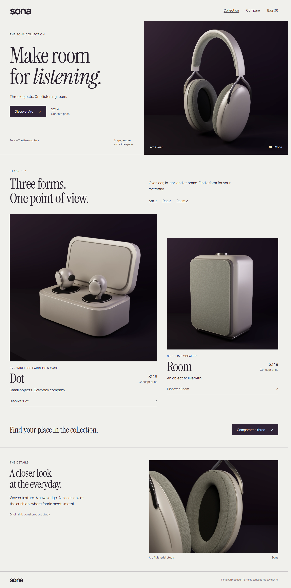

# Sona — The Listening Room

An original React and TypeScript audio storefront portfolio project. Explore Arc headphones, Dot earbuds, and the Room speaker in Pearl, Graphite, or Fig; compare their forms and concept prices; build a persistent bag with multiple products and finishes. Products and prices are fictional. No payments, orders, accounts, or backend services.



## Run locally

Requires Node.js 22.12+ and npm. From this folder:

```sh
npm ci
npm run preview:start
npm run preview:status
```

Open **http://127.0.0.1:4173/** in Chrome on this PC. The launcher starts a detached, loopback-only Vite development preview, verifies the page and all three product assets, and stores its process identity/log in ignored `.cache/`. `npm run preview:stop` stops only its verified process. If another process owns the port it leaves that process alone. The fixed origin keeps the bag's browser storage consistent. `npm run dev` is the foreground alternative.

```sh
npm run typecheck
npm run build
npm test
npm run test:e2e
```

The browser tests use installed Microsoft Edge on Windows when available, otherwise Playwright Chromium (`npx playwright install chromium` once on another machine). Tests reuse a running local preview or start it. No ESLint configuration is present; TypeScript and the production build are the existing static checks.

## What works

- Shared product-page architecture, aligned finish renders, distinct material macros, responsive shopping controls.
- Comparison of zero to three products with native checkboxes and an accessible, horizontally scrollable table on narrow screens.
- URL-driven products, finishes, comparison selection and bag state; reload, Back/Forward, route focus and normal scrolling.
- Product-and-finish cart identity, quantity limits, removal, subtotal, empty state, validated restoration and usable in-memory shopping when storage fails.
- Keyboard operation, native cart dialog, live feedback, image-loading fallbacks and reduced motion.

## Project guide

- `src/catalog.ts`: typed fictional catalog and integer-cent prices.
- `src/App.tsx`, `src/Collection.tsx`: shared product view, editorial collection, comparison and route/modal behavior.
- `src/ProductGallery.tsx`: image decode, aligned finish layers, interruptible motion.
- `src/cart/`: pure cart reducer and validated persistence behind one React provider.
- `assets/arc/`, `assets/collection/`: original editable geometry, render sources, GLBs, provenance and alignment checks. Three.js stays out of the storefront runtime.
- `tests/`: shopping, collection, history, accessibility, storage and motion browser regressions.
- [Engineering and interview notes](docs/engineering.md).
- [Current verification and publication handoff](docs/publication.md).
- [Desktop and phone before/after gallery](docs/publication/compare.html).
- `docs/refinement.md`, `docs/verification.md`: preserved historical milestone evidence.

## Publication status

Ready for local review. No Sona remote, push, deployment, or public profile edit was made. `vercel.json` supplies a Vite build and SPA fallback for a future reviewed deployment; other static hosts must likewise serve `index.html` for product/comparison routes. There is no production domain yet. Self-hosted font notices are retained in `public/fonts`; original product assets have documented provenance.

Local commits use KareemAl1. Other projects remain independent.
